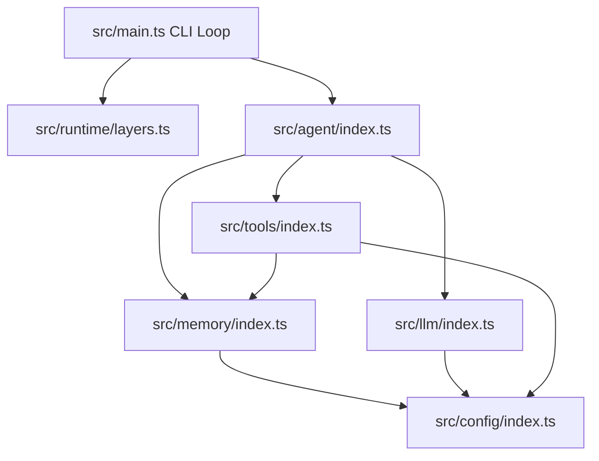

# Egeria: Core Architectural Principles & Agent Rules

This document outlines the core architectural constraints, development rules, and design patterns for **Egeria**. These rules form the foundational concepts of the codebase and **must not be bypassed** during initialization, maintenance, or further development.

---

## 1. System Architecture & Module Boundaries

Egeria is designed around the principle of **deep modules**: modules that present a small, stable, and highly focused public interface while hiding complex implementation details.



### The Strict Module Boundary Rule (No Internal Spelunking)
* **Rule**: Code residing outside a specific module (e.g., `src/agent/`) **must only** import from that module's public entrypoint `index.ts`.
* **Constraint**: Direct imports of files inside another module's `internal/` directory are strictly prohibited.
* **Example**:
  ```ts
  // ❌ VIOLATION (Importing from internal):
  import { registry } from "../tools/internal/registry.ts";

  // ✅ CORRECT (Importing from public boundary):
  import { ToolServiceTag } from "../tools/index.ts";
  ```

### Target Public Interfaces
Each module exposes a minimal, highly cohesive public API:
* **`config`**: Exposes a validated, immutable `Config` object and its `ConfigTag`.
* **`llm`**: Exposes `generate(request)` via `LlmClient` to decouple the provider SDK.
* **`memory`**: Exposes `remember(event)` and `recall(query)`.
* **`tools`**: Exposes `execute(name, input)` and `list()`.
* **`agent`**: Exposes `run(input)` to orchestrate a complete conversation turn.

---

## 2. Dependency Minimization Policy

To ensure high performance, rapid start times, and absolute predictability, Egeria adheres to a **zero-unnecessary-dependency** rule.

### Allowed Dependencies
Only the following core dependencies are permitted:
* `ai` (Vercel AI SDK) for uniform LLM streaming, tooling, and structured output.
* `effect` for type-safe effects, dependency injection, layers, error handling, retries, and timeouts.
* `zod` for strong schema validation and runtime input typing.
* `@ai-sdk/google-vertex` (or similar singular provider SDK) to supply the model execution layer.

### Banned Dependencies
Do **NOT** add dependencies for:
* CLI styling, terminal spinners, or advanced input loops.
* Small utility functions (e.g., Lodash, Ramda).
* File traversal or basic filesystem operations (use Bun's native APIs).
* Vector databases or search engines (long-term memory is file-based and powered by lightweight, local keyword indexing).
* Config loaders (e.g., `dotenv` — Bun loads `.env` natively).

---

## 3. Effect Integration & Functional Patterns

Egeria uses the **Effect** framework as its standard library for managing async code, resource lifecycles, and error boundaries.

### Strict Error Modeling
All expected failures must be modeled explicitly using type-safe custom errors extending `Data.TaggedError`. Raw exceptions must never leak across module boundaries.

| Domain Error | Tag Name | Description |
| :--- | :--- | :--- |
| `ConfigError` | `"ConfigError"` | Validation or loading failure of `.env` configuration. |
| `LlmError` | `"LlmError"` | Failures from the model API (with retryable flags & status codes). |
| `ToolError` | `"ToolError"` | Execution errors, input schema validation, or safety violations. |
| `MemoryError` | `"MemoryError"` | Filesystem read/write or search failures during memory operations. |
| `AgentError` | `"AgentError"` | Loop failures or maximum execution step overruns. |

### Single Managed Runtime for Lifecycles
* **Rule**: The entire application stack is unified into a single `ManagedRuntime` in `src/main.ts`.
* **Constraint**: Do not initialize, validate, or spin up layers (such as LLM providers or file stores) dynamically per turn. They must be validated at startup to guarantee fast fail behavior.

### Execution Generators
All complex async workflows must be implemented using `Effect.gen` and `yield*` to maintain clean, sequential, and highly readable functional code:

```ts
const runTurn = Effect.gen(function* () {
  const config = yield* ConfigTag;
  const result = yield* llm.generate(...);
  return result;
});
```

---

## 4. Agent Loop & State Management

The agent loop processes inputs, reasons, calls tools, and updates memory in an orderly flow:

```
User Input
   │
   ▼
Recall Memory ──► Ground in Local Notes
   │
   ▼
Build Prompt ───► System Prompt + Message History
   │
   ▼
Reason / Plan (LLM)
   │
   ├─► Action (Call Tool) ──► Observation (Result) ──┐
   │   ▲                                             │
   │   └─────────────────────────────────────────────┘ (Loop until done or Max Steps)
   ▼
Update State ───► Append turn to History
   │
   ▼
Response
```

### Core Invariants
1. **Stateless Public Boundary**: The agent's public `run` method is pure and stateless. It must take `AgentInput` (user message + previous `AgentState`) and return `AgentOutput` (reply + next `AgentState`). The caller (e.g., the CLI loop in `main.ts`) is responsible for threading the state across turns.
2. **Context Pruning (Capped History)**: Message history stored inside `AgentState` must be capped to prevent token bloat and context-window exhaustions. Keep the window tight (e.g., keep only the last `N` messages).
3. **Execution Guards**:
   * **Max-Step Guard**: Every agent loop must enforce a hard limit on the number of intermediate tool calls (`maxSteps`).
   * **Step-Cap Fallback**: If the agent reaches `maxSteps` without returning a final textual reply, it must not fail silently or return empty. It must fallback gracefully to a standard user-friendly message (e.g., *"I hit the step limit before finishing. Could you narrow the request?"*).
4. **Traceability Logging**: Every plan, action, and observation in the tool loop must produce detailed, structured log events (`agent.step.plan`, `agent.step.action`, `agent.step.observation`).

---

## 5. Tool Safety & Resource Policies

Any tool that interfaces with the local filesystem (such as `writeNote`, `readNotes`, or `searchNotes`) must implement rigorous safety rules to prevent unauthorized system access.

### Strict Path Traversal Guards
* **Rule**: Absolute paths must be rejected immediately.
* **Rule**: Any relative path containing parent directory markers (`..`) must be caught and rejected.
* **Rule**: All file paths must be strictly confined within the configured `NOTES_DIR`.
* **Example Implementation Pattern**:
  ```ts
  if (path.isAbsolute(filename) || filename.includes("..")) {
    return Effect.fail(new ToolError({ tool: "writeNote", message: "Path traversal rejected" }));
  }
  ```

### Resource Bounds
To avoid out-of-memory or high CPU issues, the tool layer must enforce strict resource caps:
* **Payload Truncation**: Limit the maximum bytes processed by search operations.
* **Payload Size Limits**: Reject write requests that exceed safe file boundaries (e.g., 50KB).
* **Truncation Markers**: When reading lists of notes or searching, enforce a count limit and clearly mark the output as truncated if it exceeds the limit.

---

## 6. Memory Architecture & Recall Mechanics

Egeria separates memory into two clear concepts: short-term and long-term.

### Short-Term Memory
* Lives in memory as `AgentState`.
* Comprises the active task goal, tool logs, and the immediate conversation context.

### Long-Term Memory
* Stored strictly in local Markdown files under `NOTES_DIR`.
* Organized as flat, append-only files containing notes and tasks.

### Recall & Keyword Retrieval Rules
* **Rule**: Vector databases and external search engines are **prohibited** for the core agent implementation.
* **Rule**: Use a deterministic keyword ranking mechanism:
  1. Tokenize and clean the user prompt (lowercase, remove short stop-words, deduplicate).
  2. Perform case-insensitive substring scans across local notes.
  3. Rank note files based on the count of matching tokens.
  4. Yield matching excerpts with filenames, injecting them directly into the LLM system prompt as context.

---

## 7. Reliability, Retries & Timeouts

Egeria must remain highly resilient to network flakiness, rate limits, and hanging processes.

### Timeout Policies
* **LLM Calls**: Enforce a strict timeout around every model call (configured via `LLM_TIMEOUT_MS`).
* **Tool Calls**: Enforce a strict timeout around every tool execution (configured via `TOOL_TIMEOUT_MS`).
* **Timeout Behavior**: If a timeout is hit, Effect must interrupt the fiber immediately and return a typed `LlmError` or `ToolError` instead of hanging indefinitely.

### Retry Rules
* **Safe Operations Only**: Network calls, LLM requests, and read-only tools may be retried.
* **No Retrying Unsafe Actions**: Never automatically retry non-idempotent operations (such as appending to files or executing transactional tool side-effects) unless they can be verified safe.
* **Transient vs. Fatal**:
  * Retriable failures (e.g., 429 rate limit, 5xx server error, transient TCP drop) should follow an exponential backoff retry policy (with a max retry cap of e.g. 3 attempts).
  * Fatal failures (e.g., 401 unauthorized, 403 forbidden, validation schema errors) must fail-fast immediately.
